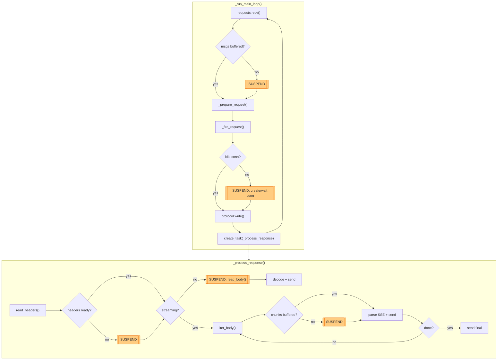
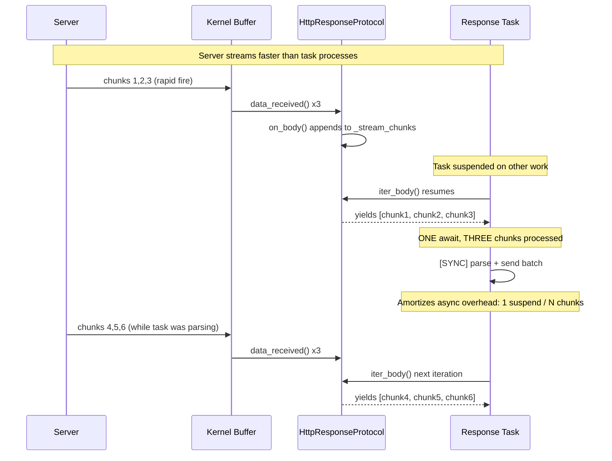

# Benchmark Hot-Path

This document describes the performance-critical data flow during benchmark execution.

---

## 1. High-Level Overview

```
╔═══════════════════════════════════════════════════════════════════════════════════════════════════════════╗
║                                              BENCHMARK EXECUTION                                          ║
╚═══════════════════════════════════════════════════════════════════════════════════════════════════════════╝

    SESSION THREAD            EVENT LOOP THREAD              WORKER PROCESS (N instances)
    (BenchmarkSession)        (uvloop)                       (Separate OS Process)
   ────────────────          ────────────────               ─────────────────────────────

   ┌─────────────┐           ┌─────────────────┐            │              ┌───────────────────────────┐         │
   │   LoadGen   │           │  SampleIssuer   │            │            ┌─┤      HTTP Worker          │◀────────┼────────▶┌──────────────────┐
   │ (Metronome) │           │  (Dispatcher)   │            │          ┌─┤ │        (Engine)           │◀────────┼────────▶│  ENDPOINT / SUT  │
   │             │──────────▶│                 │────────────┼─────────▶│ │ │                           │◀────────┼────────▶│ (vLLM / TGI etc) │
   └──────┬──────┘  issue()  └────────┬────────┘  IPC(reqs) │          │ └─┴───────────────────────────┘◀────────┼────────▶└──────────────────┘
          │                           │                     │          └────────────────────────────┘            │
     (t0: Start)                      │◀────────────────────┼────────────────────────────┘                       │
                                      │           IPC(resps)│                                      Concurrent TCP/HTTP Requests per Worker
                              ┌───────▼────────┐            │                                                    │
                              │    Metrics     │            │                                                    │
                              │(Sample Handler)│            │                                                    │
                              └───────┬────────┘            │                                                    │
                                  (t1: Stop)                │                                                    │
```

---

## 2. Complete Data Flow (Single Request)

```
SESSION THREAD (MAIN-PROC)
|
|  1. Scheduler yields (sample, delay)
|  2. Busy-wait until target time
|  3. Record Start Time (t0)
|  4. Issue query (to EVENT LOOP THREAD) --------+
|  5. Continue to next sample                    |
|                                                |
                                                 |
EVENT LOOP THREAD (MAIN-PROC)                    |
|                                                |
|  6. Dispatch to WORKER X (round-robin, IPC) <--+
|                                                |
|  10. Receive response from IPC <---------------+-----------------------+
|  11. Trigger Event Handlers                    |                       |
|      (Record TTFT / t1 Stop)                   |                       |
|                                                |                       |
                                                 |                       |
WORKER PROCESS X (SCALE-OUT)                     |                       |     ENDPOINT
|                                                |                       |        |
|  7. Recv. Requests via IPC <-------------------+                       |        |
|  8. HTTP POST Request -------------------------------------------------+------->|
|                                                                        |        |
|  9. Push response to IPC ----------------------------------------------+        |
```

---

## 3. Worker Request Lifecycle - Async Suspend Points

This section documents every async yield/suspend point in the worker hot path.

### Why Minimize Async Suspends

Each `await` is a potential context switch:

1. Current coroutine yields control to event loop
2. Event loop selects next ready task
3. Next task resumes, potentially evicting cache lines

**Key insight:** When data is already buffered, `await` returns immediately with no actual suspend.
The implementations below exploit this by draining buffers synchronously before awaiting.

Combined with `eager_task_factory` (worker.py), new tasks run synchronously until their first
_real_ suspend point - avoiding scheduler overhead for fast-path requests.

### Flow Diagram



Legend: Orange nodes are suspend points. Suspends only occur when data not already buffered.

### Design Pattern: Buffer-Drain

Both HTTP streaming and ZMQ transports use a common pattern to minimize async overhead:

**Pattern:** Accumulate data in buffer, drain ALL available synchronously, only await when empty.

| Implementation                    | Buffer             | Drain Loop                         | Await Point                       |
| --------------------------------- | ------------------ | ---------------------------------- | --------------------------------- |
| `http.py:iter_body()`             | `_stream_chunks`   | `while self._stream_chunks: yield` | `await self._stream_event.wait()` |
| `zmq/transport.py:_on_readable()` | `_deque`           | `while True: sock.recv(NOBLOCK)`   | Event loop `add_reader` callback  |
| `zmq/transport.py:_on_writable()` | `_buffer`          | `while self._buffer: sock.send()`  | Event loop `add_writer` callback  |
| `worker.py:_iter_sse_lines()`     | `incomplete_chunk` | Parse all complete events          | `async for` on `iter_body()`      |

This amortizes the cost of one await across N buffered items.

**Streaming-Buffering scenario (client slower than SSE server):**



**Tradeoff: Latency vs Throughput**

| Metric         | Batching Impact                                  | When it matters                |
| -------------- | ------------------------------------------------ | ------------------------------ |
| **TTFT**       | Adds latency (chunk waits in buffer until drain) | Online mode, user-facing       |
| **Throughput** | Improves (fewer awaits per chunk)                | Offline mode, batch processing |

The Buffer-Drain pattern optimizes for throughput. For latency-sensitive TTFT:

- `eager_task_factory` ensures response tasks start immediately (no scheduler delay)
- First chunk triggers immediate event, task resumes on next loop iteration
- Subsequent chunks batch naturally as task processes

In practice: first chunk sees minimal delay, later chunks batch efficiently.

### Detailed ASCII Diagram

```
Legend:  [AWAIT] = async suspend point     [SYNC] = synchronous (no suspend)

+------------------------------------------------------------------------------+
| _run_main_loop()                                                             |
|                                                                              |
|   +----------------------------------------------------------------------+   |
|   | MAIN LOOP ITERATION                                                  |   |
|   |                                                                      |   |
|   |  [AWAIT] 1. await requests.recv()                                    |   |
|   |      |      SUSPENDS only if deque empty (no buffered msgs)          |   |
|   |      |      NO SUSPEND if msgs already buffered                      |   |
|   |      v                                                               |   |
|   |  [SYNC]  2. _prepare_request(query)                                  |   |
|   |      v                                                               |   |
|   |  [AWAIT] 3. await _fire_request()                                    |   |
|   |      |      SUSPENDS only if no idle conn                            |   |
|   |      |      NO SUSPEND if idle conn available                        |   |
|   |      v                                                               |   |
|   |  [SYNC]  4. create_task(_process_response)                           |   |
|   |      |      eager_task_factory: runs sync until first await          |   |
|   |      v                                                               |   |
|   |  --- loop back to 1 ---                                              |   |
|   +----------------------------------------------------------------------+   |
+------------------------------------------------------------------------------+

+------------------------------------------------------------------------------+
| _fire_request()                                                              |
|                                                                              |
|   [AWAIT] A. await self._pool.acquire()                                      |
|       |      NO SUSPEND if idle conn in _idle_stack                          |
|       |      SUSPENDS if: _create_connection() or _wait_for_connection()     |
|       v                                                                      |
|   [SYNC]  B. conn.protocol.write(http_bytes)                                 |
|       |      transport.write() is non-blocking (kernel buffers)              |
|       v                                                                      |
|   return True                                                                |
+------------------------------------------------------------------------------+

+------------------------------------------------------------------------------+
| _process_response() [runs as separate Task]                                  |
|                                                                              |
|   [AWAIT] 1. await conn.protocol.read_headers()                              |
|       |      NO SUSPEND if headers already parsed                            |
|       |      SUSPENDS if waiting for header data from network                |
|       v                                                                      |
|   [branch: streaming vs non-streaming]                                       |
|                                                                              |
|   +--- NON-STREAMING -------------------------------------------------------+|
|   |                                                                         ||
|   |  [AWAIT] 2a. await conn.protocol.read_body()                            ||
|   |       |      SUSPENDS until full body received                          ||
|   |       v                                                                 ||
|   |  [SYNC]  3a. adapter.decode_response()                                  ||
|   |       v                                                                 ||
|   |  [SYNC]  4a. self._responses.send(result)                               ||
|   |                                                                         ||
|   +-------------------------------------------------------------------------+|
|                                                                              |
|   +--- STREAMING (SSE) -----------------------------------------------------+|
|   |                                                                         ||
|   |  [SYNC]  2b. accumulator = Accumulator()                                ||
|   |                                                                         ||
|   |  3b. async for chunk_batch in _iter_sse_lines():                        ||
|   |       |                                                                 ||
|   |       |   [AWAIT] async for raw_bytes in conn.protocol.iter_body():     ||
|   |       |           yields chunks accumulated since last drain            ||
|   |       |           SUSPENDS only if no chunks buffered                   ||
|   |       |                                                                 ||
|   |       |   [SYNC] _iter_sse_lines: buffer += raw_bytes                   ||
|   |       |          find complete events (delimited by \n\n)               ||
|   |       |          adapter.parse_sse_chunk() extracts content             ||
|   |       |          yield batch of parsed events                           ||
|   |       |                                                                 ||
|   |       v                                                                 ||
|   |   [SYNC] for delta in chunk_batch:                                      ||
|   |       |      accumulator.add_chunk(delta)                               ||
|   |       |      response_transport.send(stream_chunk)                      ||
|   |       |                                                                 ||
|   |       +------> loop back to 3b until stream done                        ||
|   |                                                                         ||
|   |  [SYNC]  4b. self._responses.send(final)                                ||
|   |                                                                         ||
|   +-------------------------------------------------------------------------+|
|                                                                              |
|   [SYNC]  5. self._pool.release(conn)                                        |
|              early release: before final processing                          |
|                                                                              |
+------------------------------------------------------------------------------+
```

---

## 4. CPU Pinning Strategy

The pinning strategy maximizes throughput while minimizing jitter between runs.
NUMA-aware placement reduces cross-socket memory access and cache coherency traffic.

### Key Insight

**LoadGen is the bottleneck**, not workers. LoadGen hosts:

- Main Python thread + asyncio/uvloop event loop
- ZMQ I/O threads (IPC with workers)
- Garbage collection, serialization/deserialization

Workers are mostly I/O-bound (waiting on HTTP responses).

### NUMA-Aware Algorithm

```
                    ┌─────────────────────────────────┐
                    │   PHASE 1: TOPOLOGY DISCOVERY   │
                    └─────────────────────────────────┘
                                    │
                                    ▼
                    ┌──────────────────────────────────┐
                    │ 1. Get online CPUs (cgroup-aware)│
                    │ 2. Group by NUMA: {numa: cores}  │
                    │ 3. Rank by perf (fast→slow)      │
                    └──────────────────────────────────┘
                                    │
                                    ▼
                    ┌─────────────────────────────────┐
                    │   PHASE 2: LOADGEN ASSIGNMENT   │
                    └─────────────────────────────────┘
                                    │
                                    ▼
                    ┌─────────────────────────────────┐
                    │ 1. Fastest core → Primary NUMA  │
                    │ 2. Take min(N, available) cores │
                    │    from Primary NUMA for loadgen│
                    └─────────────────────────────────┘
                                    │
                                    ▼
                    ┌─────────────────────────────────┐
                    │   PHASE 3: WORKER ASSIGNMENT    │
                    └─────────────────────────────────┘
                                    │
                                    ▼
                    ┌─────────────────────────────────┐
                    │ Build worker core list:         │
                    │                                 │
                    │ 1. Remaining Primary NUMA cores │
                    │    (sorted by perf)             │
                    │            ↓                    │
                    │ 2. Next best NUMA cores         │
                    │    (sorted by perf)             │
                    │            ↓                    │
                    │ 3. Continue until all NUMAs     │
                    └─────────────────────────────────┘
                                    │
                                    ▼
                    ┌─────────────────────────────────┐
                    │ Return AffinityPlan             │
                    └─────────────────────────────────┘
```

### Worker Core Ordering

```
┌─────────────────────────────────────────────────────────────────────┐
│                                                                     │
│   Primary NUMA          2nd best NUMA         3rd best NUMA  ...    │
│   (fastest core here)                                               │
│                                                                     │
│   ┌──┬──┬──┬──┐         ┌──┬──┬──┬──┐         ┌──┬──┬──┬──┐         │
│   │LG│LG│W0│W1│   →     │W2│W3│W4│W5│   →     │W6│W7│W8│W9│  →  ... │
│   └──┴──┴──┴──┘         └──┴──┴──┴──┘         └──┴──┴──┴──┘         │
│    ↑     ↑               ↑                     ↑                    │
│    loadgen leftover      spill                 spill                │
│                                                                     │
│   Within each NUMA: sorted by performance (fast → slow)             │
│   Across NUMAs: sorted by best core performance (fast → slow)       │
│                                                                     │
└─────────────────────────────────────────────────────────────────────┘
```

| Component   | Allocation                                 | Rationale                                                                                      |
| ----------- | ------------------------------------------ | ---------------------------------------------------------------------------------------------- |
| **LoadGen** | `DEFAULT_LOADGEN_CORES` = 5 physical cores | Session thread + event loop thread + up to 4 ZMQ I/O threads. Bottleneck - gets fastest cores. |
| **Workers** | 1 physical core each (2 logical)           | I/O-bound. Full core isolation prevents context switches, reduces jitter.                      |

> The core-ordering diagram above is schematic — it shows two `LG` cells for illustration; the actual default reserves 5 physical cores for loadgen (`DEFAULT_LOADGEN_CORES` in `cpu_affinity.py`).

### Why Both Hyperthreads Per Core

Each process owns its **entire physical core** (both hyperthreads):

- No contention from other processes on same core
- OS scheduler can use either hyperthread freely
- Consistent, predictable performance

### Why NUMA-Aware Placement

- **Memory locality**: Workers on same NUMA node as LoadGen can access shared memory without cross-socket hops
- **Cache coherency**: Reduced inter-NUMA cache invalidation traffic
- **Graceful spillover**: When Primary NUMA is exhausted, workers spill to next-best NUMA nodes

### Configuration

```yaml
# BenchmarkConfig (schema.py)
enable_cpu_affinity: true   # Auto-compute NUMA-aware plan (default)
enable_cpu_affinity: false  # Disabled (no CPU pinning)
```

See `src/inference_endpoint/endpoint_client/cpu_affinity.py` for full implementation.
