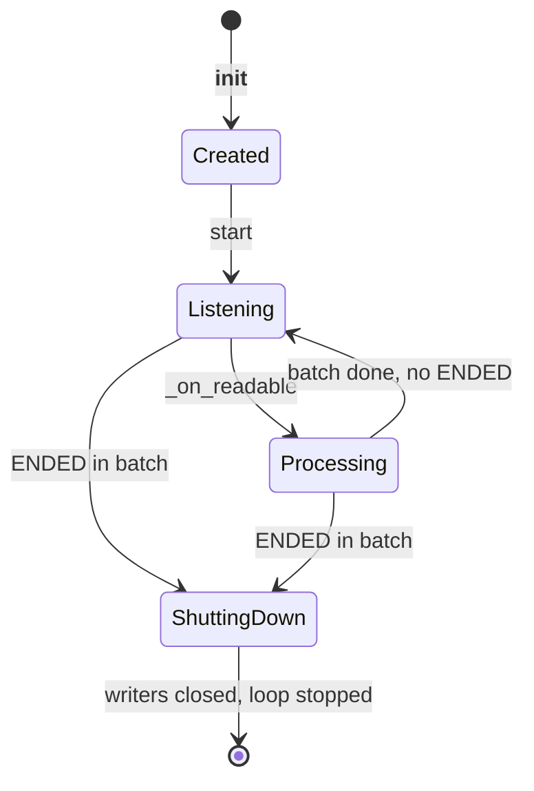
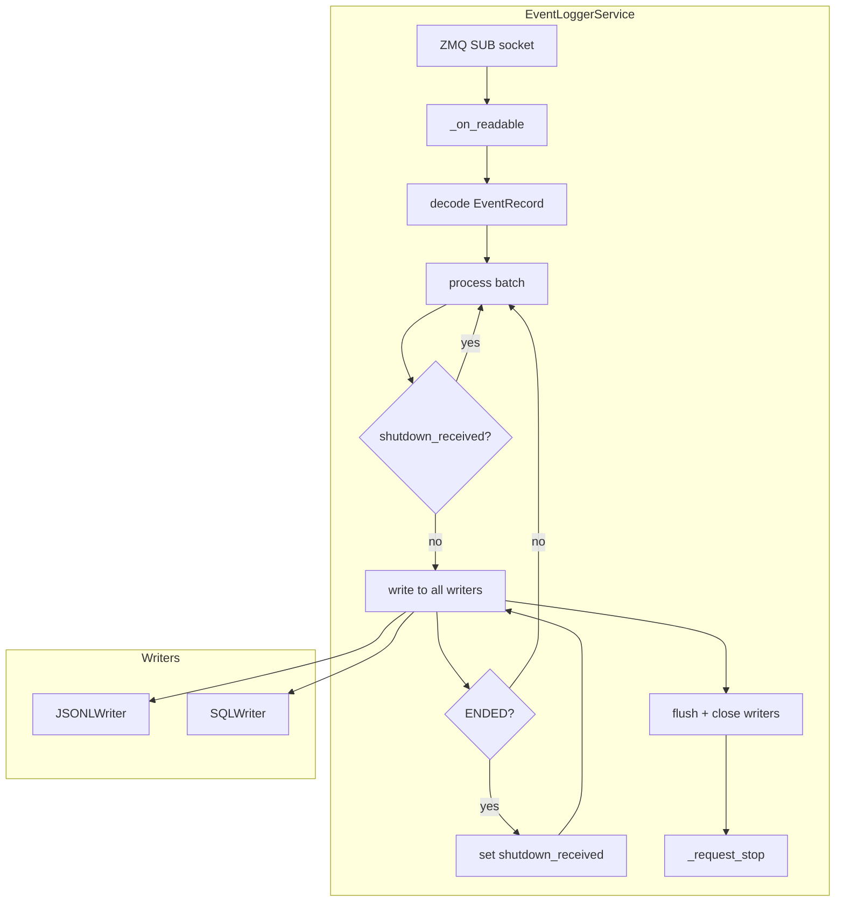

# Event Logger Service — Design Document

> ZMQ subscriber service that consumes `EventRecord` messages from the pub/sub bus and persists them to JSONL or SQLite storage backends; runs as an independent subprocess.

## Overview

The event logger is a ZMQ subscriber service that consumes `EventRecord` messages
from the pub/sub event bus and persists them to one or more storage backends.

It runs as an independent subprocess with its own event loop, connected to the
same ZMQ PUB socket as other subscriber services (e.g. metrics aggregator).

```
                        ZMQ PUB (ipc://)
                             │
              ┌──────────────┼──────────────┐
              ▼              ▼              ▼
       EventLogger   MetricsAggregator   (future subscribers)
       (JSONL/SQL)   (real-time metrics)
```

## Module Layout

```
event_logger/
├── __main__.py      # CLI entry point + EventLoggerService
├── writer.py        # RecordWriter ABC (flush interval support)
├── file_writer.py   # JSONLWriter (msgspec-based JSONL output)
└── sql_writer.py    # SQLWriter (SQLAlchemy, default sqlite)
```

## Subscribed Events

The event logger subscribes to **all topics** (`topics=None`) so that every
published `EventRecord` is persisted. It does not interpret event semantics —
it writes records verbatim to all configured writers.

The only event type with special handling is `SessionEventType.ENDED`, which
triggers shutdown (see [Lifecycle](#lifecycle)).

## Writer System

### RecordWriter ABC

`RecordWriter` defines the interface for all writer backends:

```python
class RecordWriter(ABC):
    def write(self, record: EventRecord) -> None   # calls _write_record + auto-flush
    def _write_record(self, record: EventRecord) -> None  # abstract
    def flush(self) -> None
    def close(self) -> None  # abstract
```

`write()` calls the subclass's `_write_record()`, increments a counter, and
auto-flushes when the counter reaches `flush_interval`. This keeps the flush
logic in one place regardless of backend.

### Writer Registry

The CLI maps writer names to classes via `_WRITER_REGISTRY`:

| Name    | Class         | Output File    |
| ------- | ------------- | -------------- |
| `jsonl` | `JSONLWriter` | `events.jsonl` |
| `sql`   | `SQLWriter`   | `events.db`    |

Multiple writers can be active simultaneously (e.g. `--writers jsonl sql`).
Each record is written to every configured writer.

## JSONL Writer

`JSONLWriter` writes one JSON line per `EventRecord` using `msgspec.json.Encoder`
with a custom `enc_hook` that serializes `EventType` enum members as their topic
strings (e.g. `"session.ended"`, `"sample.complete"`).

Output path: `{log_dir}/events.jsonl`

Each line is a complete JSON object representing one `EventRecord`:

```json
{
  "event_type": "sample.issued",
  "timestamp_ns": 1234567890,
  "sample_uuid": "abc-123",
  "data": null
}
```

## SQL Writer

`SQLWriter` uses SQLAlchemy (default: sqlite) and maps each `EventRecord` to an
`EventRowModel` row:

| Column         | Type         | Content                                    |
| -------------- | ------------ | ------------------------------------------ |
| `id`           | Integer (PK) | Auto-increment                             |
| `sample_uuid`  | String       | Sample UUID                                |
| `event_type`   | String       | Topic string (e.g. `"sample.complete"`)    |
| `timestamp_ns` | BigInteger   | Monotonic nanosecond timestamp             |
| `data`         | LargeBinary  | `msgspec.json.encode(record.data)` (bytes) |

Output path: `sqlite:///{log_dir}/events.db`

The backend is swappable via the `url` parameter (e.g. PostgreSQL), though the
CLI currently only supports the default sqlite path.

## Lifecycle

### Startup

```
uv run python -m inference_endpoint.async_utils.services.event_logger \
    --log-dir /path/to/logs \
    --socket-dir /path/to/socket_dir \
    --socket-name ev_pub_abc123 \
    --writers jsonl sql
```

1. Parse CLI arguments.
2. Create writer instances (one per `--writers` entry), writing to `{log_dir}/events.*`.
3. Create `ManagedZMQContext.scoped(socket_dir=args.socket_dir)` with the publisher's socket directory.
4. Create `EventLoggerService` (extends `ZmqEventRecordSubscriber`), which connects
   to the publisher via `ctx.connect(socket, socket_name)`.
5. Call `logger.start()` which registers `add_reader` on the subscriber's event loop.
6. `await shutdown_event.wait()` blocks until shutdown is signalled.

### Processing

Each batch of records decoded from the ZMQ socket is passed to `process(records)`:

```
for record in records:
    if _shutdown_received:
        skip
    if record is ENDED:
        set _shutdown_received
    write to all writers
if saw ENDED:
    flush + close writers, request stop
```

All records up to and including `SessionEventType.ENDED` are written. All records
after ENDED (in the same or subsequent batches) are dropped regardless of type.

### Shutdown

When `SessionEventType.ENDED` is received:

1. The ENDED record is written to all writers.
2. All remaining records in the batch are dropped.
3. Writers are flushed and closed; the writer list is cleared.
4. `_request_stop()` is scheduled on the event loop:
   - Removes the socket reader (via `close()`)
   - Sets the `shutdown_event` so the process can exit



## Data Flow



## CLI Interface

```
usage: uv run python -m inference_endpoint.async_utils.services.event_logger
    --log-dir LOG_DIR
    --socket-dir SOCKET_DIR
    --socket-name SOCKET_NAME
    [--writers WRITER [WRITER ...]]
```

| Argument        | Required | Default | Description                                               |
| --------------- | -------- | ------- | --------------------------------------------------------- |
| `--log-dir`     | Yes      | —       | Directory for log output files                            |
| `--socket-dir`  | Yes      | —       | Directory containing ZMQ IPC sockets (must already exist) |
| `--socket-name` | Yes      | —       | Socket name within socket-dir                             |
| `--writers`     | No       | `jsonl` | Writer backends: `jsonl`, `sql`, or both                  |

## Wiring

`publish(EventRecord(...))` calls are connected in the load generator (`BenchmarkSession`
publishes STARTED / ISSUED / COMPLETE / ERROR events via its `EventPublisher`; the prompt rides on
the `ISSUED` event's `PromptData` payload rather than a separate event), so the event
logger receives and persists all session/sample/error events published during a benchmark run.
