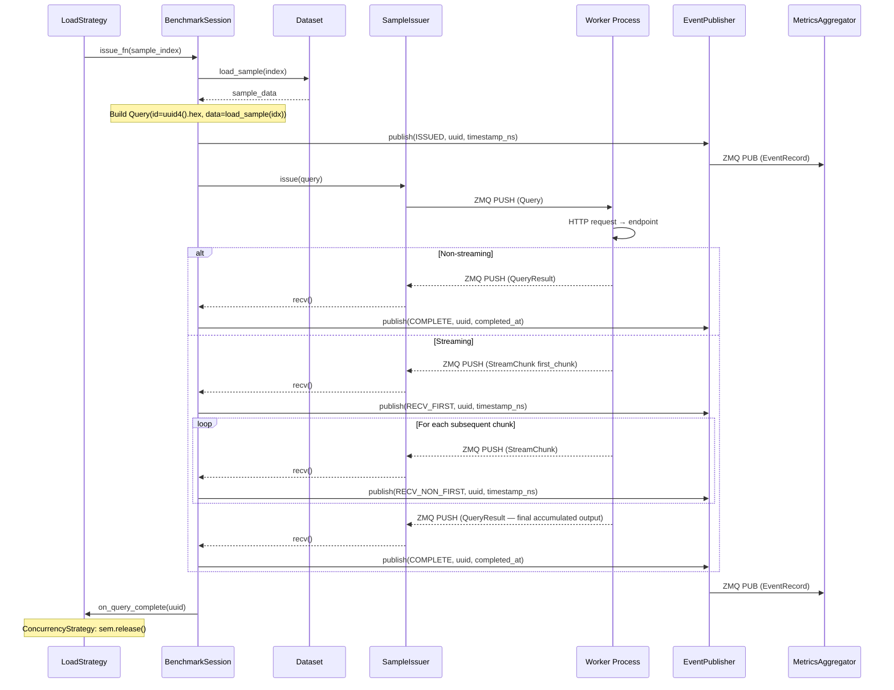
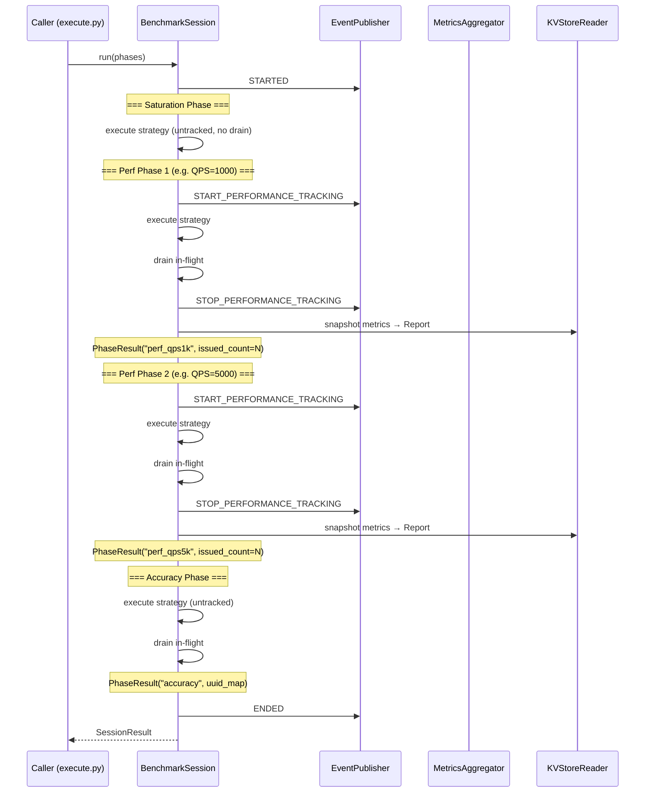
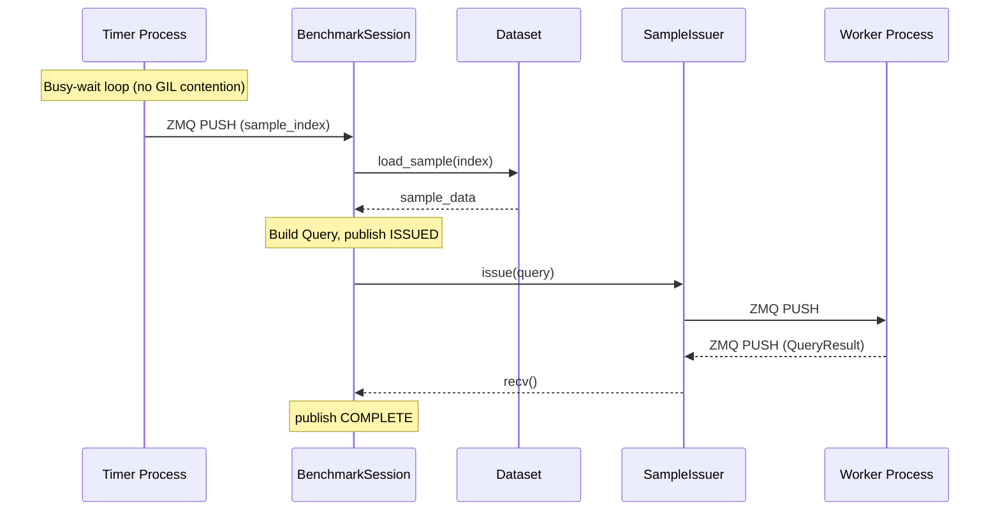
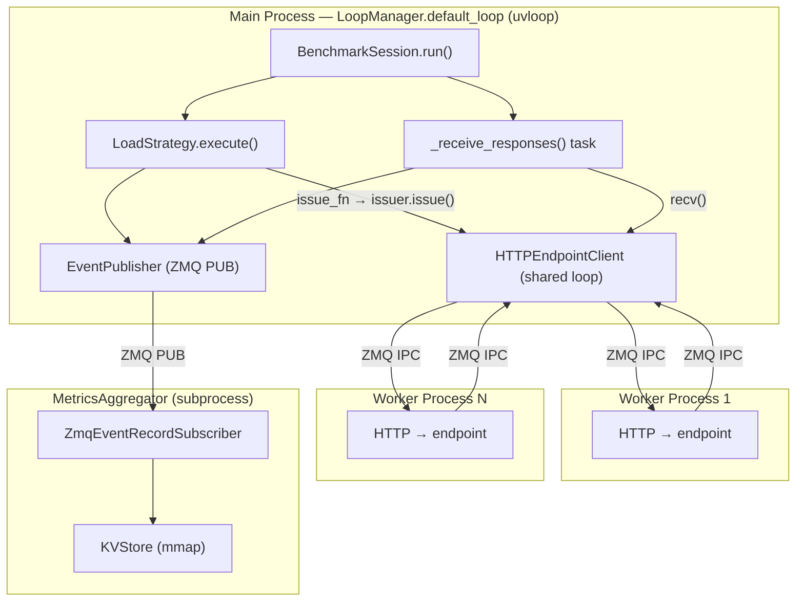
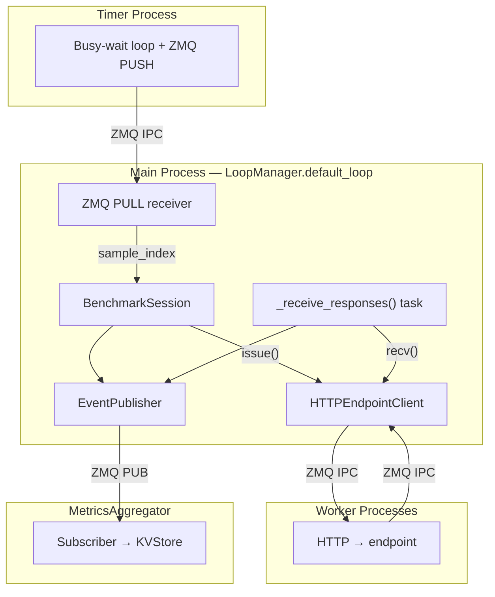

# Async Load Generator Design

## Overview

The load generator is the central scheduling component that controls _when_ and _how_
samples are issued to inference endpoints during benchmarking. It is fully async with a
single-thread, single-event-loop-per-process constraint.

## File Structure

```
src/inference_endpoint/load_generator/
├── __init__.py          # Public exports
├── session.py           # BenchmarkSession, SessionResult
├── strategy.py          # LoadStrategy protocol, TimedIssueStrategy,
│                        #   BurstStrategy, ConcurrencyStrategy,
│                        #   create_load_strategy()
├── sample_order.py      # SampleOrder, WithoutReplacement, WithReplacement
└── delay.py             # poisson_delay_fn, uniform_delay_fn
```

## Architecture

A `BenchmarkSession` runs one or more **phases** sequentially. Each phase has its own
`RuntimeSettings`, `Dataset`, and `LoadStrategy`. Phases are categorized as either
**tracked** (produces a performance metrics report) or **untracked** (performance is not evaluated).

Multiple performance phases allow testing different configurations (QPS targets,
concurrency levels, datasets) against the same server instance within a single session,
each producing an independent report.

```
BenchmarkSession.run(phases)
    |
    +-- STARTED
    +-- [warmup]     strategy.execute() → NO drain (keep in-flight saturated)
    +-- [perf phase 1]   START_PERFORMANCE_TRACKING → strategy.execute() → drain → STOP_PERFORMANCE_TRACKING
    +-- [warmup]     strategy.execute() → NO drain (keep in-flight saturated)
    +-- [perf phase 2]   START_PERFORMANCE_TRACKING → strategy.execute() → drain → STOP_PERFORMANCE_TRACKING
    +-- [accuracy x N]   strategy.execute() → drain (uuid maps collected)
    +-- ENDED
    |
    +-- return SessionResult { perf_results: [PhaseResult, ...], accuracy_results: [...] }
```

Each performance phase is bracketed by `START_PERFORMANCE_TRACKING` /
`STOP_PERFORMANCE_TRACKING` events, which the `MetricsAggregator` uses to
scope its tracked counters and duration. At the end of each perf phase,
metrics are snapshotted from the KVStoreReader and a `Report` is built.

> **TODO:** The current `MetricsAggregator` does not support per-phase scoping.
> It maintains a single set of counters and series across all tracking windows.
> To support multiple perf phases with independent reports, the aggregator will
> need either: (a) a `RESET_METRICS` event that clears counters/series between
> phases, or (b) per-phase metric namespacing (e.g., prefix keys with phase name),
> or (c) the report builder computes deltas by snapshotting before and after each
> phase. This will be addressed in a future change to the `MetricsAggregator`.
> Option (b) is the most-likely planned change as it is the most robust.

Saturation phases exist to bring the endpoint to steady-state before a
performance measurement. In-flight requests are **not drained** at the end
of a warmup phase — the next phase starts immediately with concurrency
already at the target level. Common uses:

- Fill KV caches so perf phase measures warm inference, not cold start
- Ramp concurrency to target level before measuring at that level
- Warm connection pools and OS TCP buffers

### Load Strategies

Three load patterns, three implementations — each uses the optimal async primitive
for its scheduling semantics, validated by benchmarking:

| LoadPatternType   | Strategy              | Mechanism                    | Best At             |
| ----------------- | --------------------- | ---------------------------- | ------------------- |
| POISSON           | `TimedIssueStrategy`  | `loop.call_at` (default)     | ≤50k QPS            |
| POISSON (precise) | `TimedIssueStrategy`  | `run_in_executor(busy_wait)` | Sub-100μs precision |
| MAX_THROUGHPUT    | `BurstStrategy`       | `loop.call_soon`             | Max fire rate       |
| CONCURRENCY       | `ConcurrencyStrategy` | `asyncio.Semaphore`          | Fixed concurrency   |

**Default for Poisson is `loop.call_at`:** Sub-millisecond timing precision (600–700μs)
with zero GIL contention and low response latency (0.6–1.4ms). No thread pool overhead.
Degrades above 100k+ QPS where the callback queue saturates.

`run_in_executor(busy_wait)` is available as an opt-in for workloads requiring sub-100μs
timing precision. It achieves 65–92μs but introduces GIL contention that adds 6ms
response latency at low QPS (<1k). At mid-range QPS (5k–50k), latency is comparable.

### Optional: Separate Timer Process

For workloads requiring both precise timing AND minimal response latency (e.g., edge
inference with tight TPOT budgets), the timer can run in a dedicated process:

```
Timer Process (dedicated):
    - Owns a tight busy-wait loop, no GIL contention
    - Sends (sample_index: int) via ZMQ PUSH at precise times

Main Process:
    - Receives indices via ZMQ PULL
    - Loads data, builds Query, issues via HTTPEndpointClient
    - Runs receiver coroutine — event loop is never blocked
```

This eliminates the GIL contention that causes `run_in_executor` to add approximately
6ms response latency at low QPS. However, it adds ZMQ IPC latency (10–50μs) to timing
precision.

**Not suitable for ConcurrencyStrategy**: the timer process has no visibility into
completion events, so it cannot gate on in-flight count. Concurrency mode always runs
in-process.

---

## Components

### BenchmarkSession

**File:** `src/inference_endpoint/load_generator/session.py`

Async orchestrator. Runs phases sequentially on the shared event loop.

```python
class PhaseType(str, Enum):
    """Phase types control tracking and reporting behavior."""
    PERFORMANCE = "performance"  # Tracked, produces a report
    ACCURACY = "accuracy"        # Untracked, for eval scoring
    WARMUP = "warmup"    # Untracked, ramp up concurrency before perf phase


@dataclass(frozen=True, slots=True)
class PhaseConfig:
    """Configuration for a single benchmark phase."""
    name: str
    runtime_settings: RuntimeSettings
    dataset: Dataset
    phase_type: PhaseType = PhaseType.PERFORMANCE


class BenchmarkSession:
    def __init__(
        self,
        issuer: SampleIssuer,
        event_publisher: EventPublisher,
        loop: asyncio.AbstractEventLoop,
        on_sample_complete: Callable[[QueryResult | StreamChunk], None] | None = None,
        session_id: str | None = None,
    ): ...

    async def run(self, phases: list[PhaseConfig]) -> SessionResult: ...
    def stop(self) -> None: ...
```

**`run(phases)`** lifecycle:

1. Publish `SessionEventType.STARTED`
2. Start receiver coroutine (`_receive_responses`)
3. For each phase:
   a. Create `SampleOrder` and `LoadStrategy` from phase settings
   b. Set `self._current_dataset` to phase dataset
   c. **WARMUP**: execute strategy, **do not drain** in-flight. No tracking
   events, no report. Purpose: bring endpoint to steady-state concurrency
   (e.g., fill KV caches, warm up connection pools). The next phase starts
   immediately with concurrency already at the target level.
   d. **PERFORMANCE**: publish `START_PERFORMANCE_TRACKING`, execute strategy,
   drain in-flight, publish `STOP_PERFORMANCE_TRACKING`. Snapshot metrics
   from KVStoreReader → build `PhaseResult`.
   e. **ACCURACY**: execute strategy, drain in-flight. No tracking events.
   UUID map collected for eval scoring.
4. Publish `SessionEventType.ENDED`
5. Return `SessionResult` (contains `PhaseResult` per perf phase + accuracy maps)

**Saturation phases** are particularly important for concurrency-based benchmarks.
A common pattern:

```python
phases = [
    # Ramp up to target concurrency, fill endpoint caches
    PhaseConfig("warmup", warmup_settings, dataset, PhaseType.WARMUP),
    # Measured performance run
    PhaseConfig("perf", perf_settings, dataset, PhaseType.PERFORMANCE),
    # Accuracy eval (uses same warmed endpoint)
    PhaseConfig("accuracy", acc_settings, acc_dataset, PhaseType.ACCURACY),
]
```

Or multiple performance sweeps with warmup between each:

```python
phases = [
    PhaseConfig("saturate_c32", sat_32, dataset, PhaseType.WARMUP),
    PhaseConfig("perf_c32", perf_32, dataset, PhaseType.PERFORMANCE),
    PhaseConfig("saturate_c64", sat_64, dataset, PhaseType.WARMUP),
    PhaseConfig("perf_c64", perf_64, dataset, PhaseType.PERFORMANCE),
    PhaseConfig("accuracy", acc_settings, acc_dataset, PhaseType.ACCURACY),
]
```

### PhaseIssuer

**File:** `src/inference_endpoint/load_generator/session.py` (internal to session)

Per-phase state holder that wraps the issue logic. Created fresh for each phase,
holds the phase-scoped `uuid_to_index` map and inflight counter. Passed to
strategies as a callable (`phase_issuer.issue`).

Using an object instead of a closure makes per-phase state explicit, testable
independently, and avoids the awkward tuple return pattern.

```python
class PhaseIssuer:
    """Wraps sample issuance for a single benchmark phase."""

    __slots__ = ("_dataset", "_issuer", "_publisher", "_stop_check",
                 "uuid_to_index", "inflight", "issued_count")

    def __init__(
        self,
        dataset: Dataset,
        issuer: SampleIssuer,
        publisher: EventRecordPublisher,
        stop_check: Callable[[], bool],
    ):
        self._dataset = dataset
        self._issuer = issuer
        self._publisher = publisher
        self._stop_check = stop_check
        self.uuid_to_index: dict[str, int] = {}
        self.inflight: int = 0
        self.issued_count: int = 0

    def issue(self, sample_index: int) -> str | None:
        """Load data, build Query, publish ISSUED, send to endpoint.

        Returns query_id on success, None if session is stopping.
        """
        if self._stop_check():
            return None
        query_id = uuid.uuid4().hex
        data = self._dataset.load_sample(sample_index)
        query = Query(id=query_id, data=data)
        self.uuid_to_index[query_id] = sample_index
        ts = time.monotonic_ns()
        self._publisher.publish(EventRecord(
            event_type=SampleEventType.ISSUED,
            timestamp_ns=ts,
            sample_uuid=query_id,
            data=PromptData(text=data.get("prompt")),
        ))
        self._issuer.issue(query)
        self.inflight += 1
        self.issued_count += 1
        return query_id
```

The strategy calls `phase_issuer.issue(idx)`. After the phase completes,
the session reads `phase_issuer.uuid_to_index` and `phase_issuer.issued_count`
to build the `PhaseResult`.

**UUID generation before Query construction** avoids the old `Sample` catch-22.
`Query` is a frozen `msgspec.Struct` — all fields set at construction, no mutation.

**`_receive_responses()`** — concurrent coroutine, purely async:

```python
async def _receive_responses(self):
    while not self._done:
        resp = await self._issuer.recv()
        if resp is None:
            # Transport closed — trigger stop so strategy and drain don't hang.
            self._stop_requested = True
            self._drain_event.set()
            if self._strategy_task and not self._strategy_task.done():
                self._strategy_task.cancel()
            break
        self._handle_response(resp)
```

Uses `recv()` exclusively — no `poll()` spin. The ZMQ fd is registered with
the event loop, so `recv()` wakes exactly when a response is available with
zero CPU overhead. Each `recv()` call yields to the event loop, ensuring
strategy coroutines (call_at callbacks, semaphore waiters) are never starved.

For `ConcurrencyStrategy`, `_handle_response` calls `strategy.on_query_complete()`
which releases the semaphore. Since `recv()` returns as soon as the fd is readable
and `eager_task_factory` executes the woken semaphore waiter synchronously, there
is no added latency compared to a poll-based approach.

**`_handle_response(resp)`**:

- `QueryResult`: publish COMPLETE event, decrement `_inflight`, call `on_sample_complete`,
  call `strategy.on_query_complete(query_id)` if strategy supports it
- `StreamChunk(first)`: publish RECV_FIRST event
- `StreamChunk(non-first)`: publish RECV_NON_FIRST event

**Timestamp fidelity:**

- ISSUED: `monotonic_ns()` taken immediately before `issuer.issue()`. The ZMQ push is
  sync and non-blocking, so this honestly represents when the query entered the transport.
  Note: with batched publishing, `publisher.publish()` buffers the ISSUED EventRecord
  in memory — the actual ZMQ send is deferred until the batch threshold is reached or
  `flush()` is called. The timestamp itself is still accurate (captured before buffering),
  but the EventRecord reaches subscribers with batching latency.
- COMPLETE: `QueryResult.completed_at` is set via `force_setattr(monotonic_ns())` in
  `__post_init__`, regenerated on deserialization. Both ISSUED and COMPLETE timestamps
  share the same ZMQ transit bias. TTFT (`RECV_FIRST - ISSUED`) is still sensitive
  to this overhead since it spans the full ZMQ round-trip. TPOT avoids cross-process
  clock skew by computing time deltas between consecutive chunks within the same process.

### LoadStrategy (Protocol)

**File:** `src/inference_endpoint/load_generator/strategy.py`

```python
class LoadStrategy(Protocol):
    async def execute(
        self,
        phase_issuer: PhaseIssuer,
    ) -> int:
        """Drive sample issuance. Returns count of samples issued.

        Call phase_issuer.issue(sample_index) for each sample.
        Returns None when session is stopping (max_duration, stop(), or
        all samples exhausted).
        """
        ...

    def on_query_complete(self, query_id: str) -> None:
        """Called by session on each QueryResult. Default: no-op."""
        ...
```

The strategy calls `phase_issuer.issue(idx)` which handles data loading, Query
construction, event publishing, and the actual send. The strategy only controls
_when_ and _which index_ to issue. Stop checking is internal to `PhaseIssuer.issue()`
— it returns `None` when the session should stop.

`on_query_complete` is the hook for `ConcurrencyStrategy` — other strategies ignore it.

### TimedIssueStrategy

Handles `LoadPatternType.POISSON`. Default uses `loop.call_at`; opt-in
`run_in_executor(busy_wait)` available for sub-100μs precision requirements.

```python
class TimedIssueStrategy(LoadStrategy):
    def __init__(
        self,
        delay_fn: Callable[[], int],
        sample_order: Iterator[int],
        loop: asyncio.AbstractEventLoop,
        use_executor: bool = False,
    ): ...

    async def execute(self, phase_issuer: PhaseIssuer) -> int:
        if self.use_executor:
            return await self._execute_executor(phase_issuer)
        else:
            return await self._execute_call_at(phase_issuer)
```

**call_at mode** (default):

```python
async def _execute_call_at(self, phase_issuer):
    done = asyncio.Event()
    start_time = self._loop.time()
    cumulative_s = 0.0

    def schedule_next():
        nonlocal cumulative_s
        idx = next(self.sample_order, None)
        if idx is None:
            done.set()
            return
        cumulative_s += self.delay_fn() / 1e9
        self._loop.call_at(start_time + cumulative_s, fire, idx)

    def fire(idx):
        if phase_issuer.issue(idx) is None:
            done.set()
            return
        schedule_next()

    schedule_next()
    await done.wait()
    return phase_issuer.issued_count
```

**Executor mode** (opt-in, `use_executor=True`):

```python
async def _execute_executor(self, phase_issuer):
    start = monotonic_ns()
    cumulative = 0
    for idx in self.sample_order:
        cumulative += self.delay_fn()
        target = start + cumulative
        now = monotonic_ns()
        if target > now:
            await self._loop.run_in_executor(None, _busy_wait_until, target)
        if phase_issuer.issue(idx) is None:
            break
    return phase_issuer.issued_count
```

### BurstStrategy

Handles `LoadPatternType.MAX_THROUGHPUT`. Issues all samples as fast as possible
using `loop.call_soon` to schedule each issue as an event loop callback. This
avoids starving the receiver — between each callback, the loop processes I/O
events (including ZMQ recv fd readiness).

```python
class BurstStrategy(LoadStrategy):
    def __init__(self, sample_order: Iterator[int], loop: asyncio.AbstractEventLoop): ...

    async def execute(self, phase_issuer: PhaseIssuer) -> int:
        done = asyncio.Event()

        def issue_next():
            idx = next(self.sample_order, None)
            if idx is None or phase_issuer.issue(idx) is None:
                done.set()
                return
            self._loop.call_soon(issue_next)

        self._loop.call_soon(issue_next)
        await done.wait()
        return phase_issuer.issued_count
```

Each `call_soon` yields to the event loop between issues, preventing receiver
starvation. Benchmark data shows `loop.call_at` (with zero delay, equivalent
to `call_soon`) achieves 104k QPS — the highest throughput of all strategies.

### ConcurrencyStrategy

Handles `LoadPatternType.CONCURRENCY`. Semaphore-gated by completions.

```python
class ConcurrencyStrategy(LoadStrategy):
    def __init__(self, target_concurrency: int, sample_order: Iterator[int]): ...

    async def execute(self, phase_issuer: PhaseIssuer) -> int:
        for idx in self.sample_order:
            await self._sem.acquire()
            if phase_issuer.issue(idx) is None:
                self._sem.release()
                break
        return phase_issuer.issued_count

    def on_query_complete(self, query_id: str) -> None:
        self._sem.release()
```

### SampleIssuer (Protocol)

```python
class SampleIssuer(Protocol):
    def issue(self, query: Query) -> None: ...
    async def recv(self) -> QueryResult | StreamChunk | None: ...
    def shutdown(self) -> None: ...
```

`issue()` is sync (ZMQ push). `recv()` is async blocking wait.
This matches `HTTPEndpointClient`'s existing interface.

### SampleOrder (unchanged)

`SampleOrder` is an infinite iterator yielding dataset indices. Implementations:

- `WithoutReplacementSampleOrder` — shuffle, exhaust, reshuffle
- `WithReplacementSampleOrder` — uniform random

Termination is controlled by `BenchmarkSession._make_stop_check()`, not the iterator.

### SessionResult

```python
@dataclass(frozen=True)
class PhaseResult:
    """Result of a single benchmark phase."""
    name: str
    phase_type: PhaseType
    uuid_to_index: dict[str, int]
    issued_count: int
    start_time_ns: int
    end_time_ns: int


@dataclass(frozen=True)
class SessionResult:
    """Combined results from all phases in a session."""
    session_id: str
    phase_results: list[PhaseResult]
    start_time_ns: int
    end_time_ns: int

    @property
    def perf_results(self) -> list[PhaseResult]:
        return [r for r in self.phase_results if r.phase_type == PhaseType.PERFORMANCE]

    @property
    def accuracy_results(self) -> list[PhaseResult]:
        return [r for r in self.phase_results if r.phase_type == PhaseType.ACCURACY]
```

---

## Data Flow

### Happy Path: Issue → Response → Event



### Multi-Phase Session Lifecycle



### Separate Timer Process Data Flow



---

## Event Loop Topology

### Standard (single process)



### With Separate Timer Process



---

## Load Pattern Mapping

```python
def create_load_strategy(
    runtime_settings: RuntimeSettings,
    loop: asyncio.AbstractEventLoop,
    sample_order: SampleOrder | None = None,
    use_executor: bool = False,
) -> LoadStrategy:
    lp = runtime_settings.load_pattern

    match lp.type:
        case LoadPatternType.MAX_THROUGHPUT:
            return BurstStrategy(sample_order, loop)

        case LoadPatternType.POISSON:
            delay_fn = make_delay_fn(lp, runtime_settings.rng_sched)
            return TimedIssueStrategy(delay_fn, sample_order, loop,
                                      use_executor=use_executor)

        case LoadPatternType.CONCURRENCY:
            return ConcurrencyStrategy(lp.target_concurrency, sample_order)
```

---

## Benchmark Data Summary

Measured with MaxThroughputServer + real HTTPEndpointClient:

### Poisson Mode — Strategy Comparison

| QPS    | `run_in_executor` precision | `loop.call_at` precision | `asyncio.sleep` precision |
| ------ | --------------------------- | ------------------------ | ------------------------- |
| 100    | 84 μs                       | 1,772 μs                 | 2,008 μs                  |
| 1,000  | 65 μs                       | 679 μs                   | 734 μs                    |
| 10,000 | 67 μs                       | 739 μs                   | 658 μs                    |
| 50,000 | 85 μs                       | 586 μs                   | 291 μs                    |
| 100k   | 126 μs                      | 1,043 μs                 | 65 μs                     |

Response latency at 100 QPS: `run_in_executor` = 6.2ms, `loop.call_at` = 1.4ms.
The GIL contention from the executor busy-wait thread penalizes low-QPS latency.

### Concurrency Mode

| Strategy  | QPS    | Latency (mean) |
| --------- | ------ | -------------- |
| Semaphore | 80,631 | 0.73 ms        |
| Callback  | 77,488 | 0.81 ms        |

### Max Throughput

| Strategy       | QPS     | Latency (mean) |
| -------------- | ------- | -------------- |
| `loop.call_at` | 104,039 | 1.47 ms        |
| `run_in_exec`  | 78,261  | 8.28 ms        |

---

## Integration Points

### HTTPEndpointClient

Pass `loop` to share the event loop. The client already supports this via the
`_owns_loop` flag. Two changes required:

**Initialization deadlock:** `__init__` calls `run_coroutine_threadsafe().result()`
which deadlocks when the calling thread IS the event loop thread. Fix: add an
async classmethod factory:

```python
@classmethod
async def create(cls, config: HTTPClientConfig, loop: asyncio.AbstractEventLoop) -> HTTPEndpointClient:
    client = cls.__new__(cls)
    client._setup_sync_fields(config, loop)
    await client._initialize()
    return client
```

**Shutdown deadlock:** Same pattern — `shutdown()` calls `run_coroutine_threadsafe().result()`.
Fix: expose `async shutdown_async()` as a public method. When `_owns_loop is False`,
`shutdown()` should raise if called from the event loop thread, directing callers
to use `await shutdown_async()`.

### EventPublisher / MetricsAggregator

Session publishes `EventRecord` instances via `ZmqEventRecordPublisher`. The publisher
uses non-blocking ZMQ send with fd-based writer fallback — safe to call from sync
callbacks (like `call_at` fire functions).

> **Key fix:** `Report.from_kv_reader` currently reads counter keys (`n_samples_issued`,
> `duration_ns`) that don't match the `MetricCounterKey` enum written by the aggregator
> (`total_samples_issued`, `tracked_duration_ns`). Must update `from_kv_reader` to use
> the actual key names. Performance reports should use `tracked_*` counters. A
> `test_started_at` counter must be added to the aggregator (set on `SessionEventType.STARTED`).

### HttpClientSampleIssuer Migration

The current issuer takes `Sample` and constructs `Query` internally. In the new design,
`PhaseIssuer` constructs the `Query`, so the issuer just forwards it:

```python
class HttpClientSampleIssuer:
    def __init__(self, http_client: HTTPEndpointClient):
        self.http_client = http_client

    def issue(self, query: Query) -> None:
        self.http_client.issue(query)

    async def recv(self) -> QueryResult | StreamChunk | None:
        return await self.http_client.recv()

    def shutdown(self) -> None:
        pass  # HTTPEndpointClient shutdown called separately
```

Removed from current issuer: `_handle_responses` coroutine, `SampleEventHandler`
routing, `run_coroutine_threadsafe` cross-loop dispatch. The session's
`_receive_responses` replaces all of this.

### Query.id Format

`Query.default_factory` uses `str(uuid.uuid4())` (36 chars with hyphens).
The design uses `uuid.uuid4().hex` (32 chars, no hyphens). Standardize on
`.hex` — shorter strings, no parsing overhead. Update `Query.default_factory`
to match.

### Timestamp Fidelity

- **ISSUED**: `monotonic_ns()` taken in `PhaseIssuer.issue()` immediately before
  `issuer.issue(query)`. ZMQ push is sync/non-blocking — timestamp is honest.
- **COMPLETE**: `QueryResult.completed_at` set in `__post_init__` on deserialization
  in the main process. Measures main-process receipt time, not worker-side completion.
- **TTFT**: `RECV_FIRST - ISSUED` includes full round-trip ZMQ overhead (outbound to
  worker + return to main). This adds 20-100μs of systematic bias. Acceptable for
  most benchmarks; document as a known measurement overhead.
- **Latency (COMPLETE - ISSUED)**: Both timestamps taken on the main process side.
  ZMQ transit bias is symmetric and cancels. This is the most accurate measurement.

### Stale Completions After Saturation

After a warmup phase (no drain), in-flight responses arrive during the perf
phase. The receiver must distinguish stale vs current-phase completions:

```python
def _handle_response(self, resp: QueryResult) -> None:
    query_id = resp.id
    # Always publish the event (aggregator tracks all samples)
    self._publisher.publish(EventRecord(
        event_type=SampleEventType.COMPLETE,
        timestamp_ns=resp.completed_at,
        sample_uuid=query_id,
    ))
    # Only route to current phase strategy if this is a current-phase query
    if query_id in self._current_phase_issuer.uuid_to_index:
        self._current_phase_issuer.inflight -= 1
        if self._current_strategy:
            self._current_strategy.on_query_complete(query_id)
    # Stale completions: event published but strategy/inflight not affected
```

Same guard applies to `StreamChunk` with `is_complete=True` — check
`uuid_to_index` membership before decrementing inflight. Non-final
StreamChunks don't affect inflight and can be published unconditionally.

### Sync Per-Sample Work in Callbacks

All three strategies call `PhaseIssuer.issue()` synchronously — from `call_at`
callbacks (Poisson), `call_soon` callbacks (Burst), or inline after `sem.acquire()`
(Concurrency). Each `issue()` call performs: `dataset.load_sample()`, `uuid4().hex`,
`Query` construction, `EventRecord` publish (ZMQ NOBLOCK), and `issuer.issue()`
(ZMQ NOBLOCK). The ZMQ sends are confirmed non-blocking with internal buffering.

The dominant cost is `dataset.load_sample()`. **Requirement:** datasets must be
pre-loaded into memory before the benchmark starts. If `load_sample()` performs
disk I/O, it blocks the event loop and degrades both timing precision and response
processing. For lazy-loading or disk-backed datasets, either pre-materialize
during setup or use executor mode.

At 100k+ QPS with `BurstStrategy`, the `call_soon` callback queue depth can
delay `recv()` wakeups. Benchmarking shows this is acceptable (104k QPS with
1.47ms mean response latency), but the recv latency is bounded by the queue
depth rather than being strictly real-time.

---

## CLI / Logging / TUI Integration

### CLI Integration

The CLI entry point (`commands/benchmark/execute.py`) orchestrates setup, execution,
and finalization as three sync phases:

```python
def run_benchmark(config: BenchmarkConfig, test_mode: TestMode) -> None:
    ctx = setup_benchmark(config, test_mode)        # sync: datasets, tokenizer, config
    bench = run_benchmark_async(ctx)                # async: returns BenchmarkResult
    finalize_benchmark(ctx, bench)                  # sync: scoring, report, JSON output

def run_benchmark_async(ctx: BenchmarkContext) -> BenchmarkResult:
    loop = LoopManager().default_loop
    return loop.run_until_complete(_run_benchmark_async(ctx, loop))
```

`_run_benchmark_async` sets up the ZMQ context, event publisher, service subprocesses
(metrics_aggregator and event_logger), HTTP client, and session — all inside a
`ManagedZMQContext.scoped()` block. The HTTP config is constructed locally via
`config.settings.client.with_updates(...)`.

```python
async def _run_benchmark_async(ctx, loop) -> BenchmarkResult:
    collector = ResponseCollector(collect_responses=ctx.collect_responses, pbar=pbar)

    with ManagedZMQContext.scoped(io_threads=2) as zmq_ctx:
        publisher = EventPublisherService(zmq_ctx)
        launcher = ServiceLauncher(zmq_ctx)
        await launcher.launch([
            ServiceConfig(module="...metrics_aggregator", args=aggregator_args),
            ServiceConfig(module="...event_logger", args=event_logger_args),
        ], timeout=30.0)

        http_config = config.settings.client.with_updates(...)
        http_client = await HTTPEndpointClient.create(http_config, loop)
        session = BenchmarkSession(
            issuer=HttpClientSampleIssuer(http_client),
            event_publisher=publisher, loop=loop,
            on_sample_complete=collector.on_complete_hook,
        )
        phases = _build_phases(ctx)
        loop.add_signal_handler(signal.SIGINT, session.stop)
        try:
            result = await session.run(phases)
        finally:
            loop.remove_signal_handler(signal.SIGINT)
            await http_client.shutdown_async()
            publisher.close()
            await asyncio.to_thread(launcher.wait_for_exit, None)
            report = Report.from_kv_reader(kv_reader)  # after aggregator exits

    return BenchmarkResult(session=result, collector=collector, report=report, ...)
```

`BenchmarkResult` is a dataclass bundling `SessionResult`, `ResponseCollector`,
`Report`, and tmpfs paths. `finalize_benchmark(ctx, bench)` unpacks it for
accuracy scoring, report display, and results JSON output.

### Logging

Standard Python `logging` is used throughout. Key log points:

- Phase transitions: `logger.info("Starting phase: %s (%s)", name, phase_type)`
- Sample counts: `logger.info("Phase %s complete: %d samples issued", name, count)`
- Errors: `logger.error("Failed to issue query %s: %s", query_id, error)`
- Shutdown: `logger.info("Benchmark session cancelled")`

Log level is configurable via `RuntimeSettings` / CLI `--log-level`.

### Progress Reporting (tqdm)

`ResponseCollector.on_complete_hook` drives the progress bar:

```python
class ResponseCollector:
    def __init__(self, collect_responses: bool = False, pbar: tqdm | None = None):
        self.collect_responses = collect_responses
        self.responses: dict[str, str] = {}
        self.errors: list[str] = []
        self.count = 0
        self.pbar = pbar

    def on_complete_hook(self, result: QueryResult) -> None:
        self.count += 1
        if result.error:
            self.errors.append(f"Sample {result.id}: {result.error}")
            if self.pbar:
                self.pbar.set_postfix(refresh=True, errors=len(self.errors))
        elif self.collect_responses:
            self.responses[result.id] = result.get_response_output_string()
        if self.pbar:
            self.pbar.update(1)
```

The session calls `on_sample_complete(result)` from `_handle_response`, which
fires from the `_receive_responses` coroutine on the event loop.

### Accuracy Phase Response Collection

After `session.run()` returns, accuracy responses are partitioned using
`PhaseResult.uuid_to_index`:

```python
for phase_result in result.accuracy_results:
    phase_responses = {
        uid: collector.responses[uid]
        for uid in phase_result.uuid_to_index
        if uid in collector.responses
    }
    score = scorer.score(phase_responses, phase_result.uuid_to_index, acc_dataset)
```

### Future: TUI Integration

The planned TUI architecture moves the benchmark engine (HTTPClient + load generator)
to a child process, with the TUI as the foreground process reading periodic reports.

```
TUI Process (foreground):
    - Renders live dashboard (throughput, latency, progress)
    - Reads BasicKVStoreReader for real-time metrics from /dev/shm
    - Receives SessionResult via IPC on completion

Benchmark Process (child):
    - Runs BenchmarkSession on its own event loop
    - Writes metrics via EventPublisher -> MetricsAggregator -> KVStore
    - Returns SessionResult to parent via IPC (pickle over pipe / ZMQ)
```

This architecture is enabled by the current design's clean separation:

- **KVStore** is already cross-process readable (mmap on /dev/shm)
- **BenchmarkSession** has no UI dependencies — it takes callbacks
- **SessionResult** is a frozen dataclass, trivially serializable
- The `on_sample_complete` callback would not be used in TUI mode (no
  cross-process callback). Instead, the TUI polls KVStoreReader for
  `tracked_samples_completed` to update the progress display.

The TUI process can also read the `Report` from the KVStore at any time for
live intermediate reports (current QPS, latency distribution so far), not
just the final report.

> **Constraint:** The benchmark child process must be a **non-daemon** OS process
> (e.g., `subprocess.Popen` or `multiprocessing.Process(daemon=False)`).
> `HTTPEndpointClient` spawns worker processes via `WorkerManager`, and those
> workers are `daemon=True`. Python prohibits daemon processes from spawning
> children — if the benchmark process is itself a daemon, worker creation fails.

> **TODO:** Signal forwarding: SIGINT from the terminal goes to the foreground
> process group (TUI). The TUI must forward a stop signal to the benchmark
> child process (e.g., via `process.terminate()` or a ZMQ control channel).
> Design the stop protocol during TUI implementation.

---

## Multi-Perf Sweep Example

Concurrency sweep against same endpoint:

```python
phases = [
    PhaseConfig("sat_c16", sat_settings(16), ds, PhaseType.WARMUP),
    PhaseConfig("perf_c16", perf_settings(16), ds, PhaseType.PERFORMANCE),
    PhaseConfig("sat_c32", sat_settings(32), ds, PhaseType.WARMUP),
    PhaseConfig("perf_c32", perf_settings(32), ds, PhaseType.PERFORMANCE),
    PhaseConfig("sat_c64", sat_settings(64), ds, PhaseType.WARMUP),
    PhaseConfig("perf_c64", perf_settings(64), ds, PhaseType.PERFORMANCE),
    PhaseConfig("accuracy", acc_settings, acc_ds, PhaseType.ACCURACY),
]
result = await session.run(phases)

for pr in result.perf_results:
    print(f"{pr.name}: {pr.report.qps or 0:.0f} QPS")
```

---

## Rejected Alternatives

| Alternative                             | Rejected Because                                                                           |
| --------------------------------------- | ------------------------------------------------------------------------------------------ |
| Unified strategy for all patterns       | Benchmark data shows each pattern benefits from different async primitives                 |
| `asyncio.Semaphore` for all concurrency | Correct for CONCURRENCY mode, but overhead hurts MAX_THROUGHPUT                            |
| `run_in_executor` for all timing        | GIL contention causes 6ms latency at low QPS                                               |
| `asyncio.sleep` for all timing          | 700μs precision at mid-range QPS, `run_in_executor` is 10x better                          |
| Direct busy-wait on event loop          | Starves receiver — 26ms response latency vs 0.6ms                                          |
| Callback-based concurrency              | Semaphore is simpler and benchmarks slightly better with real ZMQ client                   |
| Shared `Scheduler` base class           | Concurrency has no delay concept; forcing it conflates distinct semantics                  |
| Separate `BenchmarkOrchestrator`        | Phase sequencing is simple enough to live in `BenchmarkSession.run()`                      |
| poll()-based receiver spin              | Starves event loop during response bursts; pure recv() is fd-driven with zero CPU overhead |
